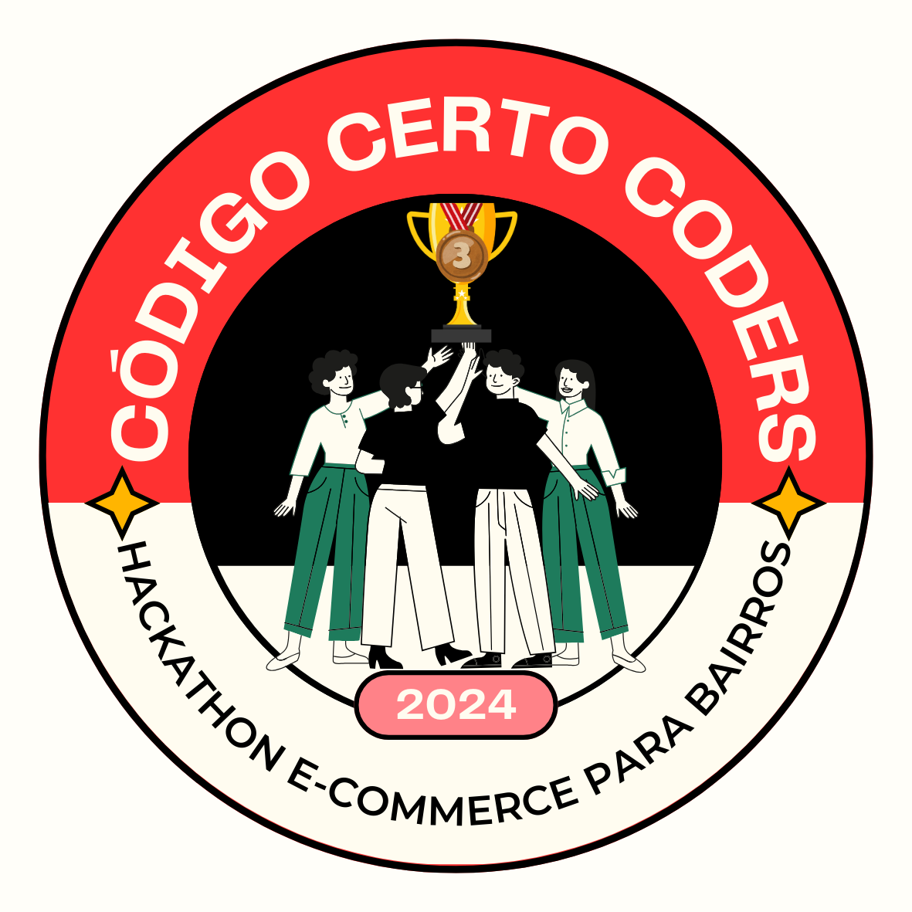

# Equipe Guardians of the Code - 3º Lugar 🥉

Parabéns, **Guardians of the Code (Equipe 14)**! Vocês conquistaram o 3º lugar no Hackathon Código Certo Coders.

## Compartilhe seu Sucesso 🎉

Aqui está o badge de 3º lugar que vocês podem compartilhar nas redes sociais para celebrar a vitória:

- **[Link para Download do Badge](./3-lugar-badge.png)**

### Como Usar o Badge

1. Baixe o badge clicando no link acima.
2. Poste no LinkedIn ou GitHub como parte do seu portfólio.
3. Use a hashtag **#HackathonCódigoCerto** e mostre sua conquista à comunidade!

---

[Voltar para a Lista de Equipes](./README.md)
